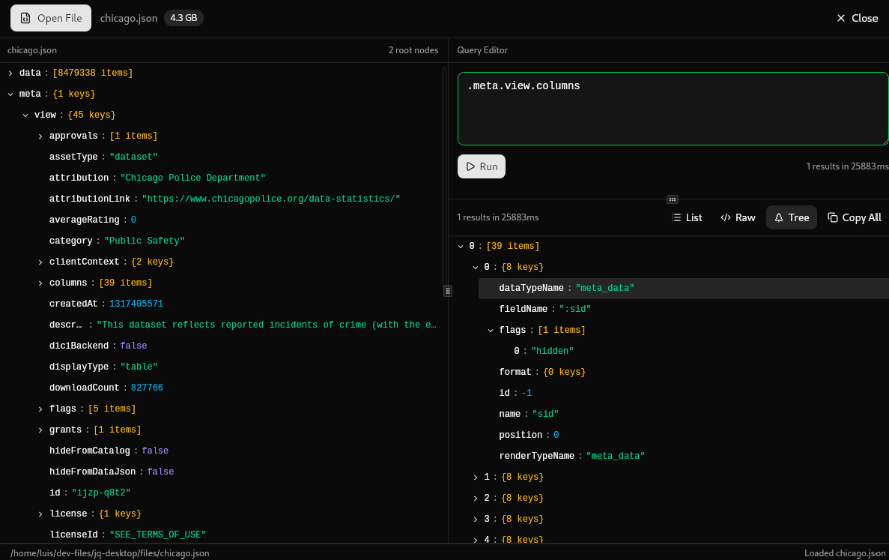

# jq-desktop



A cross-platform desktop app for interactively exploring and querying JSON files using [jq](https://jqlang.org). Load large JSON files, write jq queries with real-time validation, and explore results in a tree, list, or raw view — all without leaving your desktop.

## Features

- **Interactive JSON tree explorer** — browse deeply nested JSON with expandable/collapsible nodes, lazy-loading, and pagination for large files
- **jq query editor** — write queries with real-time validation and inline error feedback (300ms debounce)
- **3 result view modes** — switch between List, Raw JSON, and Tree views for query results
- **Result tree explorer** — same interactive tree UX as the source explorer, applied to query output
- **Copy JSON paths and values** — copy the jq path (e.g. `$.users[0].name`) or full value from any node in one click
- **Large file support** — results are stored in Rust and fetched on demand, avoiding JS heap pressure on multi-MB files
- **Keyboard shortcuts** — run queries and manage files without reaching for the mouse

### Keyboard Shortcuts

| Shortcut | Action |
|----------|--------|
| `Ctrl+Enter` / `Cmd+Enter` | Run query |
| `Ctrl+O` / `Cmd+O` | Open file |
| `Ctrl+W` / `Cmd+W` | Close file |
| `Escape` | Cancel running query |

## Download

Download the latest release for your platform from the [Releases page](https://github.com/luis-c465/jq-desktop/releases/latest).

| Platform | File |
|----------|------|
| **macOS (Apple Silicon)** | `.dmg` (`aarch64`) |
| **macOS (Intel)** | `.dmg` (`x86_64`) |
| **Linux** | `.AppImage`, `.deb`, or `.rpm` |
| **Windows** | `.exe` (NSIS installer) or `.msi` |

> **macOS note:** The app is not notarized. On first launch, right-click the app and choose **Open** to bypass Gatekeeper.

## Building from Source

### Prerequisites

- [Rust](https://rustup.rs) (stable toolchain)
- [Node.js](https://nodejs.org) (LTS)
- [Bun](https://bun.sh)
- Linux only: `libwebkit2gtk-4.1-dev`, `libappindicator3-dev`, `librsvg2-dev`, `libgtk-3-dev`

### Development

```bash
bun install
bun tauri dev
```

### Production build

```bash
bun tauri build
```

Bundles are written to `src-tauri/target/release/bundle/`.

## Tech Stack

| Layer | Technology |
|-------|-----------|
| Desktop framework | [Tauri 2.0](https://tauri.app) |
| Frontend | React 19, TypeScript, Vite, Tailwind CSS 4 |
| UI components | shadcn/ui, react-arborist, react-resizable-panels |
| Backend / jq engine | Rust, [jaq](https://github.com/01mf02/jaq) (jq-compatible) |
